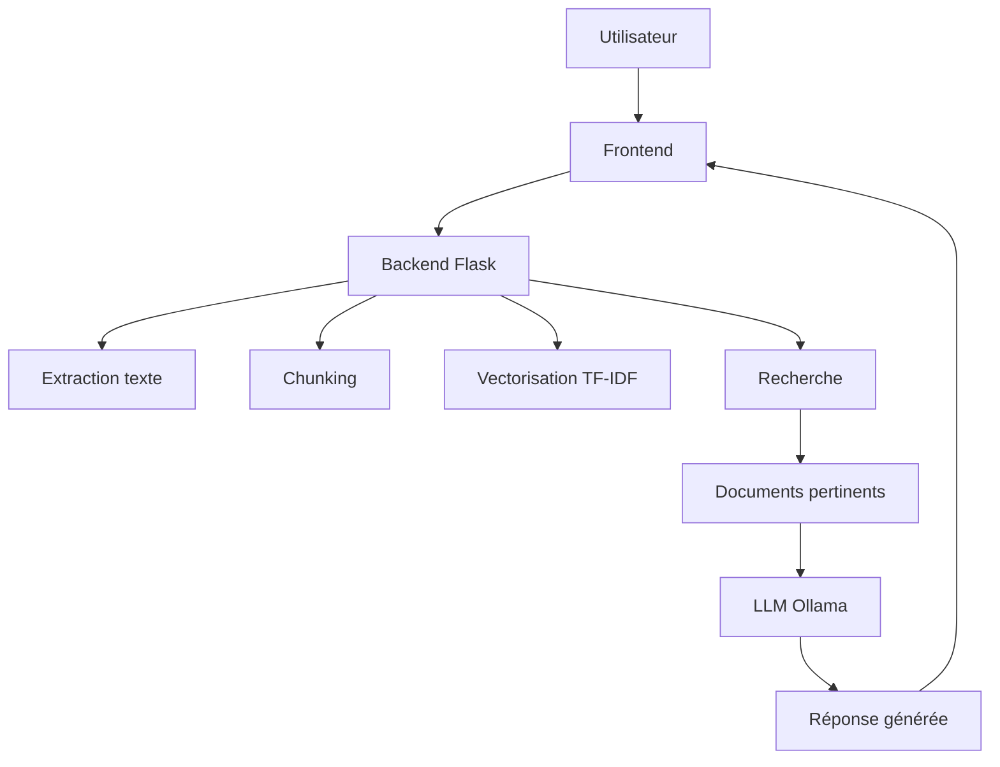

# 🧠 RAG Defense

### Retrieval-Augmented Generation avec LLM Local


---

## 🚀 Aperçu

RAG Defense est un système intelligent permettant de poser des questions sur des documents et d’obtenir des réponses générées par un **LLM local**, sans dépendre d’API externes.

---

## 🧩 Architecture du système



---

## ⚙️ Fonctionnalités

* 🔐 Authentification sécurisée
* 📄 Upload de documents (PDF, DOCX, TXT)
* 🔎 Recherche intelligente (TF-IDF)
* 🤖 Génération avec LLM local (Ollama)
* 📊 Logs des requêtes
* 🛠️ Interface Admin
* ⚡ Pipeline RAG complet

---

## 📸 Interface (exemple)


---

## 🏗️ Structure du projet

```bash
rag-defense/
│
├── backend/
│   ├── app/
│   ├── services/
│   ├── db/
│   ├── models/
│   └── requirements.txt
│
├── frontend/
│   ├── templates/
│   └── static/
│
├── data/
│   ├── docs/
│   ├── index/
│   └── db/
│
└── README.md
```

---

## 🖥️ Prérequis

* Python 3.9+
* pip
* Git
* Ollama

---

## 🤖 Installation du LLM

```bash
ollama serve
ollama pull llama3
```

---

## 🚀 Installation

### 1. Cloner

```bash
git clone https://github.com/TON-USERNAME/rag-defense.git
cd rag-defense
```

---

### 2. Environnement virtuel

#### Windows

```bash
python -m venv venv
venv\Scripts\activate
```

#### Mac / Linux

```bash
python3 -m venv venv
source venv/bin/activate
```

---

### 3. Installer dépendances

```bash
cd backend
pip install -r requirements.txt
```

---

### 4. Initialiser la base

```bash
python db/init_db.py
```

---

## 🔐 Création de l’utilisateur Admin

Le projet inclut un script de test permettant de créer automatiquement un utilisateur administrateur.

### ▶️ Commande

Depuis le dossier `backend` :

```bash
# Activer l'environnement virtuel
venv\Scripts\activate   # Windows
# ou
source venv/bin/activate  # Mac/Linux

# Lancer le script de création
python -m services.test_auth_service
```

---

### ✅ Résultat attendu

```text
Utilisateur créé avec id = 1
Utilisateur trouvé : admin - ADMIN
Mot de passe correct pour : admin
```

---

### 🔑 Identifiants par défaut

* **Username** : `admin`
* **Password** : `admin`
* **Rôle** : `ADMIN`

---

### ⚠️ Important

* Ce script initialise automatiquement la table `users`
* Il crée un utilisateur administrateur prêt à l’emploi
* À utiliser uniquement en environnement de développement / démonstration

---

### 💡 Astuce

Exécuter ce script après :

```bash
python db/init_db.py
```

pour garantir que la base de données est prête.

---


## ▶️ Lancer le projet

```bash
python app/main.py
```

🔗 Accès : http://127.0.0.1:8000/login

---

## 🧠 Fonctionnement RAG

1. Upload document
2. Extraction texte
3. Découpage en chunks
4. Vectorisation TF-IDF
5. Recherche des passages pertinents
6. Envoi au LLM
7. Génération réponse

---

## 📊 Logs

Le système enregistre :

* Question
* Réponse
* Documents utilisés
* Date

---

## 🧹 Reset base de données

```bash
rm data/db/rag.db
python backend/db/init_db.py
```

---

## ⚠️ Limitations

* TF-IDF (pas embeddings avancés)
* Dépendance aux documents
* Performance machine
* LLM local (CPU/RAM)

---

## 🚀 Améliorations futures

* FAISS / Chroma DB
* Embeddings avancés
* Multi-langue
* UI moderne
* Optimisation LLM

---

## 🎓 Contexte

Projet réalisé dans le cadre d’un **PFE — Académie Royale Militaire**

---

## 👤 Auteur

* Nom : Ton Nom
* Année : 2026
* Projet : RAG Defense

---

## ⭐ Bonus

Si ce projet t’aide, n’hésite pas à ⭐ le repo !
